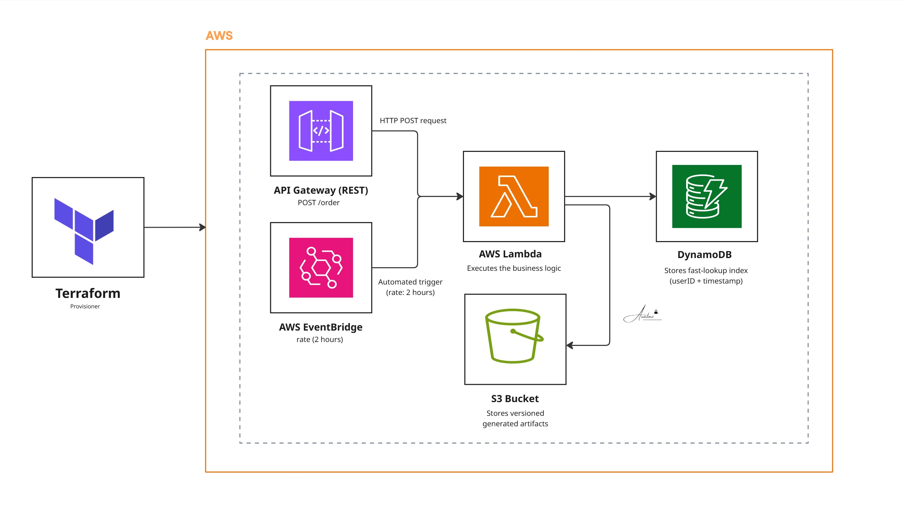

# Project 15: Serverless Event Aggregation API

This project is a fully serverless API backend built on AWS using Terraform. It is designed to take incoming data either from an on-demand HTTP API request or a scheduled background job process it via a Node.js Lambda function, and safely store the results.. 

The entire stack is parameterized by `project` and `environment` variables, meaning you can easily spin up isolated `dev`, `staging`, and `prod` versions of this infrastructure without any naming conflicts.

## Architecture



## How It Works

*   **Two Ways to Trigger:** The central Lambda function can be invoked in two ways: synchronously via an API Gateway POST request, or asynchronously via an EventBridge schedule that runs every two hours.
*   **Smart Data Storage:** Fast, lightweight event records are indexed in a DynamoDB table so they are easy to search. Meanwhile, larger output files are saved to an Amazon S3 bucket. We keep S3 versioning enabled so historical data is never accidentally overwritten. 
*   **Built-in Code Packaging:** You don't need a separate CI/CD pipeline just to zip the Lambda code. Terraform handles running `npm install` and zipping the code locally before deploying it. It also tracks the code hash, so it only triggers a new Lambda deployment when your actual Node.js code changes.
*   **Strict Security:** The IAM permissions are locked down. Instead of giving the Lambda function broad access to all S3 buckets or databases, Terraform dynamically grants it access to *only* the specific DynamoDB table and S3 bucket created for this environment.

## Stack

Terraform (>= 1.3) · AWS Lambda (Node.js 18) · API Gateway (REST) · DynamoDB · Amazon S3 · EventBridge

## Prerequisites

*   **Terraform** (>= 1.3) installed.
*   **Node.js and npm** installed locally (Terraform uses this to package the Lambda function).
*   **AWS CLI** configured with standard permissions to create these resources.

## Deployment

To build the infrastructure and get your live API URL, simply run:

```bash
terraform init
terraform plan
terraform apply
```

Once deployed, you can test the live HTTP endpoint by passing some JSON data to the API Gateway URL provided in your Terraform outputs:

```bash
curl -X POST "$(terraform output -raw api_endpoint)/order" \
     -H "Content-Type: application/json" \
     -d '{"userID":"u1","payload":"test-event-data"}'
```

## Teardown Notes

Because we enabled versioning on the S3 bucket to protect your data, a standard `terraform destroy` will fail if there are any old file versions left inside it. 

Before destroying the infrastructure, you need to completely empty the bucket using the AWS CLI. Replace `<bucket>` with your actual bucket name:

```bash
aws s3api delete-objects --bucket <bucket> \
  --delete "$(aws s3api list-object-versions --bucket <bucket> \
    --query '{Objects: Versions[].{Key:Key,VersionId:VersionId}}')"

terraform destroy
```
